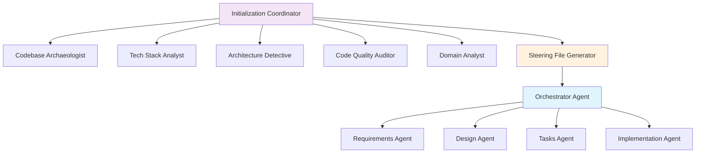
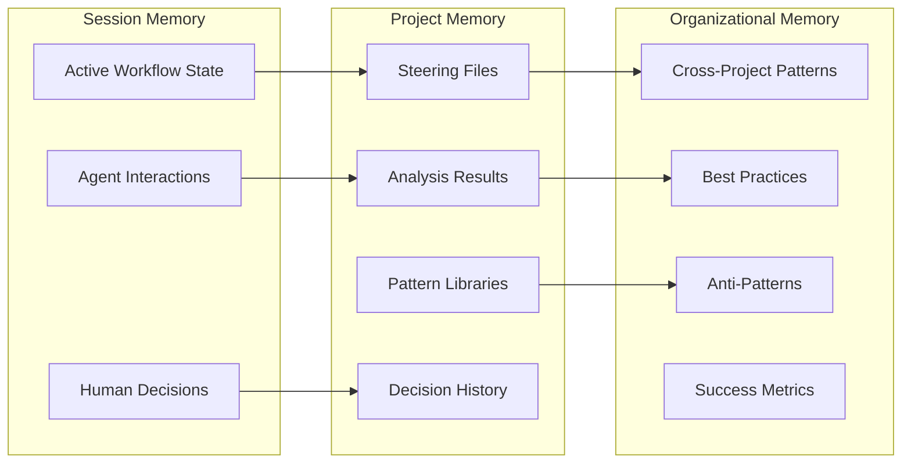
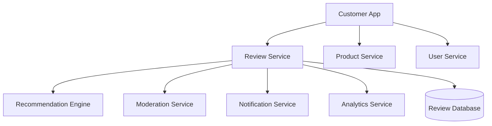

# Comprehensive System Documentation

## Table of Contents
1. [Workflow Documentation](#workflow-documentation)
2. [Agent Architecture](#agent-architecture)
3. [State Continuity & Memory Management](#state-continuity--memory-management)
4. [MCP Integration](#mcp-integration)
5. [Practical Examples](#practical-examples)

---

## Workflow Documentation

The system includes 5 main workflows designed for different phases of project development:

### 1. Project Initialization Workflow (`project-initialization.yml`)

**Purpose**: Basic project onboarding with codebase analysis and steering file generation.

**Duration**: 30-60 minutes
**Human Interaction**: 2 approval gates
**Phases**: 10 sequential phases

```yaml
Workflow Phases:
1. Environment Setup (5 min)
2. Repository Structure Discovery (10 min) 
3. Technology Stack Analysis (10 min)
4. Architecture Pattern Discovery (10 min)
5. Code Quality Assessment (5 min)
6. Business Domain Understanding (10 min)
7. Security & Performance Assessment (5 min)
8. [HUMAN GATE] Analysis Review (human decision)
9. Intelligent Steering Generation (5 min)
10. Context Storage & Finalization (5 min)
```

**Best For**: 
- New projects adopting spec-driven development
- Teams wanting quick setup with basic context understanding
- Projects with limited time for comprehensive analysis

**Outputs**:
- 4 intelligent steering files
- Basic project analysis
- Development setup recommendations

### 2. Complete Project Onboarding Workflow (`onboarding-complete.yml`)

**Purpose**: Comprehensive 360-degree project analysis and setup.

**Duration**: 60-90 minutes  
**Human Interaction**: 3 major approval gates
**Phases**: 13 comprehensive phases

```yaml
Workflow Phases:
1. Project Readiness Assessment (5 min)
2. Deep Repository Analysis (15 min)
3. Complete Technology Analysis (15 min)  
4. Architecture Deep Analysis (15 min)
5. Comprehensive Quality Assessment (10 min)
6. Business Domain Analysis (10 min)
7. [HUMAN GATE] Analysis Validation (human review)
8. Intelligent Steering Generation (10 min)
9. Development Environment Analysis (10 min)
10. Security & Compliance Assessment (10 min)
11. Performance & Scalability Analysis (5 min)
12. Knowledge Base Creation (10 min)
13. [HUMAN GATE] Final Approval (human decision)
```

**Best For**:
- Large, complex existing projects
- Enterprise environments requiring comprehensive analysis
- Teams needing detailed understanding before development
- Projects with compliance or security requirements

**Outputs**:
- Complete project intelligence
- Comprehensive documentation suite
- Performance baselines
- Security assessments
- Knowledge base integration

### 3. Context Discovery Workflow (`context-discovery.yml`)

**Purpose**: Multi-dimensional context analysis for deep project understanding.

**Duration**: 45-60 minutes
**Human Interaction**: 2 validation gates  
**Approach**: Parallel multi-dimensional analysis

```yaml
Analysis Dimensions (Parallel):
├── Structural Context Analysis
│   ├── Directory organization patterns
│   ├── File naming conventions  
│   ├── Module boundary analysis
│   └── Component organization insights
├── Behavioral Context Analysis
│   ├── Interaction pattern analysis
│   ├── Data flow context
│   ├── Event handling patterns
│   └── Workflow discovery
├── Domain Context Analysis
│   ├── Domain model extraction
│   ├── Business rule discovery
│   ├── User journey analysis
│   └── Domain language glossary
└── Technical Context Analysis
    ├── Technology usage patterns
    ├── Integration analysis
    ├── Performance context
    └── Security context
```

**Best For**:
- Projects needing deep contextual understanding
- Complex domain-driven applications
- Systems with intricate business logic
- Multi-service architectures

**Outputs**:
- Multi-dimensional context documentation
- Pattern libraries
- Cross-dimensional relationship maps
- Contextual guidance frameworks

### 4. Spec Generation Workflow (`spec-generation.yml`)

**Purpose**: Three-phase feature specification creation with human approval gates.

**Duration**: 15-30 minutes per feature
**Human Interaction**: 3 approval gates (one per phase)
**Phases**: Sequential with mandatory human approval

```yaml
Workflow Phases:
1. Requirements Generation
   ├── Convert feature request to EARS format
   ├── Extract user stories and acceptance criteria
   ├── Validate completeness and testability
   └── [HUMAN GATE] Requirements approval
2. Design Generation  
   ├── Create technical architecture
   ├── Generate component diagrams
   ├── Specify API contracts and data models
   └── [HUMAN GATE] Design approval
3. Task Generation
   ├── Break design into executable tasks
   ├── Map dependencies and priorities
   ├── Estimate effort and timeline
   └── [HUMAN GATE] Implementation plan approval
4. Specification Storage
   └── Store approved specs for implementation
```

**Best For**:
- Regular feature development
- Teams following strict approval processes
- Projects requiring traceability
- Iterative development cycles

**Outputs**:
- Formal requirements documentation
- Technical design specifications
- Executable implementation plans
- Full traceability matrix

### 5. Context Discovery Workflow (Advanced) (`context-discovery.yml`)

**Purpose**: Specialized workflow for extracting and documenting project context.

**Duration**: 45-75 minutes
**Focus**: Deep contextual intelligence gathering
**Approach**: Multi-agent parallel analysis with synthesis

**Key Capabilities**:
- **Pattern Library Creation**: Automatically generate reusable pattern libraries
- **Knowledge Gap Analysis**: Identify areas where context is incomplete
- **Cross-Context Integration**: Synthesize insights across different analytical dimensions
- **Contextual Guidance Generation**: Create actionable guidance based on discovered context

---

## Agent Architecture

The system employs 13 specialized agents organized in a hierarchical structure:

### Coordination Agents

#### 1. **Orchestrator Agent** (`orchestrator/`)
- **Role**: Master workflow coordinator
- **Specialization**: Multi-agent orchestration and quality gates
- **Key Responsibilities**:
  - Coordinate entire spec-driven workflow
  - Manage human approval gates
  - Preserve context across phases
  - Maintain traceability from request to implementation
  - Handle error scenarios and workflow recovery
- **Decision Authority**: Final decisions on workflow progression
- **Context Access**: Full context from all phases and steering files

#### 2. **Initialization Coordinator** (`initialization-coordinator/`)
- **Role**: Project onboarding orchestration
- **Specialization**: Complex multi-agent initialization workflows
- **Key Responsibilities**:
  - Orchestrate comprehensive project analysis
  - Coordinate multiple analysis agents in parallel
  - Synthesize diverse analysis results
  - Manage initialization quality gates
  - Create comprehensive project intelligence

### Analysis Agents

#### 3. **Codebase Archaeologist** (`codebase-archaeologist/`)
- **Role**: Repository structure and history analyst
- **Specialization**: Directory organization, file classification, git history
- **Key Capabilities**:
  - Map directory structures and organizational patterns
  - Classify files by type and purpose
  - Analyze git history for development patterns
  - Identify unused or orphaned code
  - Extract development activity patterns
- **Analysis Output**: Repository structure analysis, file classification, development insights

#### 4. **Tech Stack Analyst** (`tech-stack-analyst/`)
- **Role**: Technology ecosystem specialist
- **Specialization**: Language, framework, and dependency analysis
- **Key Capabilities**:
  - Identify all technologies and versions
  - Map dependency trees and relationships
  - Assess security vulnerabilities and updates
  - Analyze build and deployment configurations
  - Evaluate modernization opportunities
- **Analysis Output**: Complete technology inventory, dependency health report, modernization roadmap

#### 5. **Architecture Detective** (`architecture-detective/`)
- **Role**: Architectural pattern identification specialist
- **Specialization**: Design patterns, component relationships, system boundaries
- **Key Capabilities**:
  - Identify architectural patterns (MVC, microservices, etc.)
  - Map component dependencies and relationships
  - Analyze data flow and communication patterns
  - Discover integration points and boundaries
  - Assess architectural quality and consistency
- **Analysis Output**: Architecture documentation, component maps, integration analysis

#### 6. **Code Quality Auditor** (`code-quality-auditor/`)
- **Role**: Code standards and quality analyst
- **Specialization**: Coding conventions, testing patterns, maintainability
- **Key Capabilities**:
  - Extract coding standards and conventions
  - Analyze testing strategies and coverage
  - Assess code maintainability and complexity
  - Identify technical debt patterns
  - Evaluate documentation quality
- **Analysis Output**: Code quality metrics, standards documentation, improvement recommendations

#### 7. **Domain Analyst** (`domain-analyst/`)
- **Role**: Business context extraction specialist
- **Specialization**: Business domain modeling, user workflows, business rules
- **Key Capabilities**:
  - Extract business domain models from code
  - Identify user personas and workflows
  - Map business rules and logic
  - Analyze feature capabilities
  - Create domain language glossaries
- **Analysis Output**: Business domain model, user analysis, feature mapping

### Synthesis Agents

#### 8. **Steering File Generator** (`steering-file-generator/`)
- **Role**: Project context synthesizer
- **Specialization**: Transform analysis into actionable guidance
- **Key Capabilities**:
  - Synthesize multi-dimensional analysis results
  - Generate evidence-based steering files
  - Create context-aware development guidelines
  - Extract patterns and codify best practices
  - Customize guidance for team context
- **Output**: Intelligent steering files (product.md, tech.md, structure.md, security.md)

#### 9. **Knowledge Synthesizer** (`knowledge-synthesizer/`)
- **Role**: Comprehensive knowledge integration
- **Specialization**: Cross-dimensional synthesis and knowledge base creation
- **Key Capabilities**:
  - Integrate insights across all analysis dimensions
  - Create searchable knowledge bases
  - Build cross-reference mappings
  - Generate decision frameworks
  - Establish learning recommendations

### Specification Agents

#### 10. **Requirements Agent** (`requirements/`)
- **Role**: Senior Business Analyst
- **Specialization**: EARS-format requirements, user stories
- **Key Capabilities**:
  - Convert feature requests to formal requirements
  - Generate EARS-syntax acceptance criteria
  - Identify edge cases and error conditions
  - Ensure testability and measurability
  - Maintain requirements traceability
- **Output Format**: Formal requirements documentation with EARS acceptance criteria

#### 11. **Design Agent** (`design/`)
- **Role**: Principal Software Architect
- **Specialization**: Technical architecture, system design
- **Key Capabilities**:
  - Create comprehensive technical designs
  - Generate Mermaid.js architectural diagrams
  - Specify API contracts and data models
  - Address security and performance considerations
  - Ensure design-requirements alignment
- **Output Format**: Technical design documents with diagrams and specifications

#### 12. **Tasks Agent** (`tasks/`)
- **Role**: Technical Project Manager
- **Specialization**: Implementation planning, task breakdown
- **Key Capabilities**:
  - Decompose designs into executable tasks
  - Map task dependencies and sequencing
  - Estimate effort and identify risks
  - Ensure task-requirement traceability
  - Create parallel execution opportunities
- **Output Format**: Detailed implementation plans with task breakdowns

#### 13. **Implementation Agent** (`implementation/`)
- **Role**: Senior Full-Stack Developer
- **Specialization**: Code generation, testing, documentation
- **Key Capabilities**:
  - Generate production-ready code
  - Follow project patterns and conventions
  - Create comprehensive test suites
  - Implement security best practices
  - Maintain code documentation
- **Output Format**: Production-ready code with tests and documentation

### Agent Communication Patterns



---

## State Continuity & Memory Management

The system implements sophisticated state management across multiple dimensions:

### 1. **Workflow State Management**

#### Context Preservation Mechanisms
```yaml
Context Preservation Strategy:
  Phase Transitions:
    - Previous phase outputs → Next phase inputs
    - Human feedback → Context updates
    - Decision rationale → Decision history
    - Validation results → Quality metrics
  
  Inter-Agent Communication:
    - Shared context objects
    - Standardized data formats
    - Consistent naming conventions
    - Cross-reference mappings
```

#### State Persistence Layers
- **Session State**: Maintained during active workflow execution
- **Workflow State**: Persisted across workflow phases and human interactions
- **Project State**: Long-term storage of project context and patterns
- **Cross-Project State**: Shared learning across multiple projects

### 2. **MCP Continuity Integration**

#### Memory Architecture


#### Context Storage Strategy
- **Immediate Context**: Active workflow variables and agent states
- **Project Context**: Comprehensive project understanding and patterns
- **Historical Context**: Previous decisions and their outcomes
- **Learning Context**: Patterns that improve future recommendations

### 3. **Knowledge Graph Management**

#### Entity Relationships
```yaml
Knowledge Graph Structure:
  Projects:
    - has_architecture: Architecture Pattern
    - uses_technology: Technology Stack
    - follows_patterns: Code Patterns
    - implements_features: Business Features
  
  Features:
    - derived_from: Requirements
    - implemented_by: Design + Tasks
    - follows_patterns: Implementation Patterns
    - impacts_components: System Components
  
  Patterns:
    - applies_to: Project Types
    - succeeds_in: Contexts
    - conflicts_with: Anti-Patterns
    - evolves_into: Pattern Variations
```

#### Relationship Types
- **Structural**: Component relationships, dependencies
- **Temporal**: Evolution patterns, sequence relationships
- **Causal**: Decision rationale, outcome relationships
- **Similarity**: Pattern matching, analogy relationships

### 4. **Cross-Workflow Learning**

#### Pattern Recognition Engine
```python
# Conceptual learning algorithm
class PatternLearningEngine:
    def analyze_workflow_success(self, workflow_id, outcomes):
        """Analyze successful workflows to extract patterns"""
        patterns = self.extract_decision_patterns(workflow_id)
        success_factors = self.correlate_with_outcomes(patterns, outcomes)
        return self.codify_learnings(success_factors)
    
    def recommend_based_on_similarity(self, current_context):
        """Recommend actions based on similar successful contexts"""
        similar_projects = self.find_similar_contexts(current_context)
        successful_patterns = self.extract_success_patterns(similar_projects)
        return self.adapt_to_current_context(successful_patterns, current_context)
```

#### Learning Dimensions
- **Requirement Patterns**: Successful requirement structures and formats
- **Design Patterns**: Architectural decisions that led to positive outcomes
- **Implementation Patterns**: Code patterns associated with quality and maintainability
- **Process Patterns**: Workflow optimizations that improved efficiency

---

## MCP Integration

The system leverages Model Context Protocol (MCP) for persistent memory and external integrations:

### 1. **MCP Server Configuration**

#### Primary MCP Servers
```yaml
# .claude/config/mcp-integration.yml
mcp_servers:
  continuity:
    description: "Persistent context and memory across agent interactions"
    connection:
      type: "stdio"
      command: "npx"
      args: ["@continuity/mcp-server"]
    capabilities:
      - memory_persistence
      - context_retrieval
      - relationship_mapping
      - pattern_analysis
  
  filesystem:
    description: "Enhanced file system operations"
    connection:
      type: "stdio" 
      command: "npx"
      args: ["@modelcontextprotocol/server-filesystem", "--base-path", "."]
    capabilities:
      - file_operations
      - directory_management
      - template_processing
      - change_monitoring
  
  git:
    description: "Git operations and history analysis"
    connection:
      type: "stdio"
      command: "npx"
      args: ["@modelcontextprotocol/server-git"]
    capabilities:
      - version_control
      - history_analysis
      - commit_patterns
      - branch_management
```

### 2. **Continuity MCP Server Setup**

#### Installation
```bash
# Install Continuity MCP Server
npm install -g @continuity/mcp-server

# Verify installation
npx @continuity/mcp-server --version
```

#### Configuration
```json
{
  "mcpServers": {
    "continuity": {
      "command": "npx",
      "args": ["@continuity/mcp-server"],
      "env": {
        "CONTINUITY_STORAGE_PATH": ".claude/continuity",
        "CONTINUITY_LOG_LEVEL": "info"
      }
    }
  }
}
```

### 3. **MCP Tool Usage Patterns**

#### Context Storage Operations
```python
# Conceptual MCP tool usage
class MCPIntegration:
    def store_workflow_context(self, workflow_id, context_data):
        """Store workflow context in Continuity"""
        return self.mcp_tools.continuity.store_context({
            "id": workflow_id,
            "type": "workflow_context",
            "data": context_data,
            "relationships": self.extract_relationships(context_data)
        })
    
    def retrieve_similar_contexts(self, current_context):
        """Retrieve similar contexts for pattern matching"""
        return self.mcp_tools.continuity.search({
            "type": "similarity_search",
            "context": current_context,
            "limit": 10,
            "threshold": 0.7
        })
    
    def analyze_success_patterns(self, domain, timeframe):
        """Analyze patterns from successful outcomes"""
        return self.mcp_tools.continuity.analyze_patterns({
            "domain": domain,
            "timeframe": timeframe,
            "outcome_filter": "successful",
            "pattern_types": ["architectural", "process", "technical"]
        })
```

#### File System Operations
```python
def enhanced_file_operations():
    """Enhanced file operations through MCP"""
    # Template processing
    template_content = mcp_tools.filesystem.process_template({
        "template_path": ".claude/templates/requirements.md",
        "variables": extracted_context,
        "output_format": "markdown"
    })
    
    # Change monitoring
    mcp_tools.filesystem.watch_changes({
        "paths": ["src/", "docs/", ".claude/"],
        "events": ["create", "modify", "delete"],
        "callback": "context_update_trigger"
    })
```

### 4. **MCP Integration Benefits**

#### For Project Intelligence
- **Persistent Memory**: Context survives across Claude Code sessions
- **Pattern Learning**: System learns from successful implementations
- **Cross-Project Intelligence**: Insights shared across different projects
- **Relationship Mapping**: Rich understanding of component relationships

#### For Development Workflow
- **Context Continuity**: Seamless context preservation across workflow phases
- **Historical Analysis**: Access to previous decisions and their outcomes
- **Predictive Recommendations**: Suggestions based on similar successful patterns
- **Quality Learning**: Continuous improvement of recommendations

---

## Practical Examples

### Example 1: Starting a New Project

#### Scenario: Web Application with Authentication

**Step 1: Initial Setup**
```bash
# Create new project directory
mkdir my-new-webapp
cd my-new-webapp

# Copy spec-driven system
cp -r /path/to/spec-driven-code/.claude ./

# Initialize git repository
git init
```

**Step 2: Basic Project Structure**
```bash
# Create basic structure
mkdir -p src/{components,services,utils}
mkdir -p tests/{unit,integration}
mkdir docs
echo "# My New Web App" > README.md
```

**Step 3: Launch Project Initialization**
```
Launch initialization-coordinator agent with project initialization workflow.

Project Details:
- Project Root: /absolute/path/to/my-new-webapp
- Project Name: "My New Web App"
- Project Type: "new"
- Analysis Scope: "basic"
- Team Context: {
    "team_size": 3,
    "experience_level": "mixed",
    "preferred_practices": ["testing", "security", "documentation"],
    "technology_preferences": ["React", "Node.js", "PostgreSQL"]
  }

Since this is a new project, focus on:
1. Setting up initial steering files based on team preferences
2. Creating project structure recommendations
3. Establishing development workflow guidelines
4. Setting up basic quality gates and standards
```

**Expected Workflow (New Project)**:
1. **Basic Analysis** (10 min) - Analyze minimal existing structure
2. **Team Context Integration** (5 min) - Incorporate team preferences and practices
3. **Technology Recommendations** (10 min) - Suggest tech stack based on requirements
4. **Structure Planning** (10 min) - Recommend project organization patterns
5. **Steering File Generation** (10 min) - Create initial guidance files
6. **Development Setup** (10 min) - Generate development workflow recommendations

**Generated Assets**:
- Steering files tailored to team preferences
- Recommended project structure
- Development workflow guidelines
- Initial quality standards
- Basic CI/CD recommendations

### Example 2: Onboarding an Existing Complex Project

#### Scenario: Large E-commerce Platform

**Step 1: Copy System**
```bash
cd /path/to/existing-ecommerce-platform
cp -r /path/to/spec-driven-code/.claude ./
```

**Step 2: Launch Comprehensive Onboarding**
```
Launch initialization-coordinator agent with complete project onboarding workflow.

Project Details:
- Project Root: /absolute/path/to/existing-ecommerce-platform
- Project Name: "E-commerce Platform"
- Analysis Scope: "comprehensive"
- Team Context: {
    "team_size": 12,
    "experience_level": "senior",
    "preferred_practices": ["microservices", "TDD", "DDD", "security_first"],
    "compliance_requirements": ["PCI-DSS", "GDPR", "SOC2"]
  }
- Analysis Focus: {
    "architecture": true,
    "business_domain": true,
    "security": true,
    "performance": true,
    "testing": true
  }

This is a large existing platform. Please perform comprehensive analysis including:
1. Full repository structure and pattern analysis
2. Complete technology stack assessment
3. Microservices architecture mapping
4. Business domain modeling
5. Security posture assessment
6. Performance baseline establishment
7. Compliance requirement analysis
```

**Expected Workflow (Existing Complex Project)**:
```
Phase 1: Project Assessment (5 min)
├── Repository size: 50,000+ files
├── Technology complexity: High
├── Recommended approach: Comprehensive with sampling
└── Estimated duration: 75-90 minutes

Phase 2: Repository Analysis (15 min)
├── Directory structure mapping
├── File classification (source, tests, config, docs)
├── Git history analysis (5000+ commits)
└── Development activity patterns

Phase 3: Technology Deep Analysis (15 min)  
├── Multi-language detection (JavaScript, Python, Go)
├── Framework identification (React, Django, Docker)
├── Dependency analysis (500+ dependencies)
├── Security vulnerability assessment
└── Modernization opportunities

Phase 4: Architecture Deep Analysis (20 min)
├── Microservices boundary identification
├── Service communication patterns
├── Data flow analysis
├── Integration point mapping
└── API gateway and service mesh analysis

Phase 5: Business Domain Analysis (15 min)
├── E-commerce domain modeling
├── User journey mapping (customers, admins, vendors)
├── Business rule extraction
├── Feature capability assessment
└── Domain language glossary creation

Phase 6: Security & Compliance Analysis (15 min)
├── PCI-DSS compliance assessment
├── GDPR data handling analysis
├── Authentication/authorization patterns
├── Security vulnerability scan
└── Compliance gap identification

[HUMAN GATE] Comprehensive Review
├── Present detailed analysis summary
├── Highlight critical findings
├── Identify knowledge gaps
└── Request approval or refinement

Phase 7: Intelligent Steering Generation (10 min)
├── Generate product.md from business analysis
├── Generate tech.md from technology patterns
├── Generate structure.md from architecture analysis
├── Generate security.md from compliance requirements
└── Create custom compliance guidelines

Phase 8: Knowledge Base Integration (10 min)
├── Store all analysis in Continuity MCP
├── Create searchable pattern libraries
├── Build cross-reference mappings
└── Establish monitoring triggers
```

**Generated Assets (Complex Project)**:
- **Comprehensive Analysis** (50+ pages of documentation)
- **Intelligent Steering Files** based on discovered patterns
- **Architecture Documentation** with service maps and diagrams
- **Security Assessment** with compliance gap analysis
- **Performance Baseline** with optimization recommendations
- **Business Domain Model** with user workflows and rules
- **Knowledge Base** with searchable project intelligence

### Example 3: Generating a Feature Specification

#### Scenario: Adding User Review System to E-commerce Platform

**Context**: After comprehensive onboarding, the system understands:
- Existing microservices architecture
- User authentication patterns
- Database schemas and data models
- API design conventions
- Business domain (products, users, orders)

**Step 1: Launch Spec Generation**
```
Launch orchestrator agent with spec generation workflow.

Feature Request: "Implement a comprehensive user review system that allows customers to rate and review products they have purchased. The system should support review moderation, helpful votes, review filtering, and integration with the product recommendation engine."

Context:
- This builds on the existing e-commerce platform
- Must integrate with existing user authentication
- Should follow established API patterns
- Needs to comply with existing security standards
- Should align with current microservices architecture
```

**Expected Workflow**:
```
Phase 1: Requirements Generation (5-10 min)
├── Analyze request against existing business domain
├── Extract user stories for different personas (customers, moderators, admins)
├── Generate EARS-format acceptance criteria
├── Consider integration with existing systems (auth, products, recommendations)
├── Apply existing business rules and constraints
└── Generate formal requirements.md

[HUMAN GATE] Requirements Review
├── Review generated user stories
├── Validate acceptance criteria completeness
├── Confirm integration requirements
├── Approve or request revisions

Phase 2: Design Generation (10-15 min)
├── Design following existing microservices patterns
├── Create data models consistent with existing schemas
├── Specify APIs following established conventions
├── Design integration points with product and user services
├── Address security requirements (authentication, authorization)
├── Consider performance implications
└── Generate comprehensive design.md with diagrams

[HUMAN GATE] Design Review  
├── Review architectural alignment
├── Validate integration approach
├── Confirm security considerations
├── Approve technical design

Phase 3: Task Generation (5-10 min)
├── Break design into implementation tasks
├── Follow existing development patterns
├── Include testing requirements per project standards
├── Map dependencies on existing services
├── Estimate effort based on similar past features
├── Create deployment and monitoring tasks
└── Generate detailed tasks.md

[HUMAN GATE] Implementation Plan Review
├── Review task breakdown completeness
├── Validate effort estimates
├── Confirm dependency management
├── Approve implementation plan
```

**Generated Specification Example**:

**requirements.md** (excerpt):
```markdown
# Requirements: User Review System

## User Stories

### Epic: Customer Product Reviews
**Priority**: Must

#### Story 1: Product Review Creation
**As a** verified customer  
**I want** to create a rating and written review for products I have purchased  
**So that** I can share my experience with other customers

**Acceptance Criteria**:
1. **WHEN** a verified customer accesses a product page for a purchased item **THEN** the system **SHALL** display a "Write Review" option
2. **WHEN** a customer submits a review **THEN** the system **SHALL** validate the review content and rating (1-5 stars)
3. **WHERE** inappropriate content is detected **THE** system **SHALL** flag the review for moderation **WITHIN** 1 second
4. **WHEN** a review is successfully submitted **THEN** the system **SHALL** send a confirmation notification **AND** update the product's review statistics

#### Story 2: Review Moderation
**As a** content moderator  
**I want** to review flagged reviews before they are published  
**So that** the platform maintains content quality standards

**Acceptance Criteria**:
1. **WHEN** a review is flagged **THEN** the system **SHALL** add it to the moderation queue **AND** notify moderators
2. **WHEN** a moderator approves a review **THEN** the system **SHALL** publish it immediately **AND** update product statistics
3. **WHEN** a moderator rejects a review **THEN** the system **SHALL** notify the customer with rejection reason
```

**design.md** (excerpt):
```markdown
# Technical Design: User Review System

## Architecture

### System Context
This review system integrates with the existing e-commerce microservices architecture:



### API Specification

#### POST /api/reviews
**Purpose**: Create a new product review

**Authentication**: Required (JWT token)

**Request**:
```json
{
  "productId": "uuid",
  "rating": 5,
  "title": "Great product!",
  "content": "This product exceeded my expectations...",
  "recommendToFriend": true
}
```

**Business Rules Applied**:
- Must be verified purchaser (validated against existing order system)
- One review per customer per product (enforced by existing business rules)
- Content moderation using existing moderation service patterns
```

**tasks.md** (excerpt):
```markdown
# Implementation Plan: User Review System

## Phase 1: Core Review Service (5 days)

### 1.1 Database Layer Setup
- [ ] **Task 1.1.1**: Create review service database migration
  - **Requirements Traceability**: REQ-001, REQ-002
  - **Effort**: 4 hours
  - **Pattern Applied**: Existing database migration patterns
  - **Completion Criteria**: Migration creates tables following existing schema conventions
  
- [ ] **Task 1.1.2**: Implement Review model following existing patterns
  - **Requirements Traceability**: REQ-001, REQ-003
  - **Effort**: 6 hours  
  - **Pattern Applied**: Existing domain model patterns
  - **Dependencies**: Task 1.1.1
```

### Example 4: Continuing Development on Existing Project

#### Scenario: Adding OAuth Integration to Existing Authentication System

**Context**: Project previously onboarded, system understands:
- Current authentication implementation (JWT-based)
- Existing user model and database schema
- Security patterns and compliance requirements
- Integration patterns with external services

**Step 1: Feature Request**
```
The system already understands our authentication architecture from the initial onboarding.

New Feature Request: "Add OAuth integration supporting Google and GitHub login while maintaining compatibility with our existing JWT-based authentication system. Users should be able to link multiple OAuth providers to their existing accounts."

Requirements Context:
- Maintain backward compatibility with existing auth
- Follow established security patterns
- Integrate with existing user management system  
- Support account linking for existing users
- Maintain audit trail per compliance requirements
```

**System Response** (leveraging existing context):
```
Based on my understanding of your existing authentication architecture:

Current System Analysis:
✅ JWT-based authentication with refresh tokens
✅ User model with email/password authentication  
✅ Role-based authorization system
✅ Audit logging for security events
✅ Session management with Redis
✅ GDPR-compliant user data handling

I'll generate specifications that integrate OAuth while preserving these existing patterns.

Proceeding with Requirements Generation...
```

**Generated Requirements** (context-aware):
```markdown
# Requirements: OAuth Integration

## Integration Constraints (From Existing System)
- **MUST** maintain compatibility with existing JWT token format
- **MUST** preserve existing user roles and permissions
- **MUST** maintain audit logging patterns for compliance
- **SHALL** integrate with existing Redis session management

## User Stories

### Story 1: OAuth Account Linking
**As an** existing user with email/password authentication  
**I want** to link my Google and GitHub accounts  
**So that** I can use multiple login methods for convenience

**Acceptance Criteria**:
1. **WHEN** an authenticated user accesses account settings **THEN** the system **SHALL** display OAuth provider linking options
2. **WHEN** user initiates OAuth linking **THEN** the system **SHALL** redirect to provider following existing redirect pattern  
3. **WHEN** OAuth callback succeeds **THEN** the system **SHALL** create provider link **AND** log security event per existing audit patterns
```

The system automatically applies learned patterns and constraints, significantly reducing the specification time and ensuring consistency with existing architecture.

## Benefits of Comprehensive System Understanding

### 1. **Context-Aware Specifications**
- Requirements consider existing user workflows and business rules
- Designs integrate seamlessly with current architecture
- Implementation tasks follow established patterns and conventions

### 2. **Reduced Specification Time**
- No need to explain existing system constraints
- Automatic application of learned patterns
- Focus on new functionality rather than integration concerns

### 3. **Consistency Assurance**
- All new features align with established architectural patterns
- Consistent naming conventions and code organization
- Uniform security and performance standards

### 4. **Quality Preservation**
- New code maintains or improves existing quality levels
- Test patterns consistent with current test suite
- Documentation follows established project standards

This comprehensive approach transforms AI-assisted development from generic code generation to intelligent, context-aware development that truly understands and extends your existing systems.