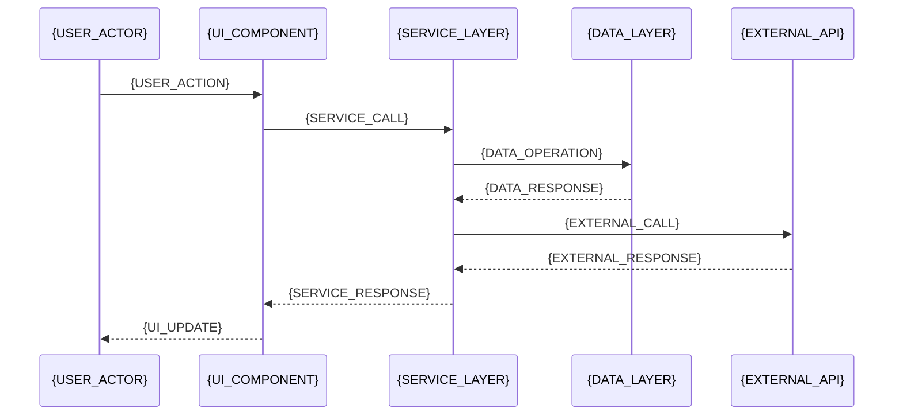
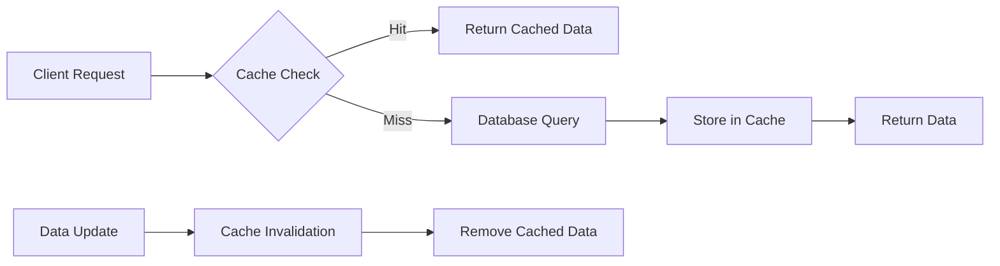
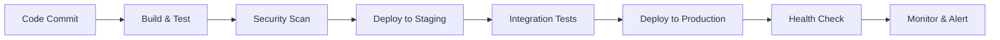

# Technical Design: {FEATURE_NAME}

**Feature ID**: {FEATURE_ID}  
**Design Version**: {DESIGN_VERSION}  
**Created**: {CREATED_DATE}  
**Last Updated**: {UPDATED_DATE}  
**Status**: {DESIGN_STATUS}

## Overview

### Problem Statement
{PROBLEM_DESCRIPTION}

### Solution Approach
{HIGH_LEVEL_SOLUTION_APPROACH}

### Key Design Decisions
- **{DECISION_1}**: {RATIONALE_1}
- **{DECISION_2}**: {RATIONALE_2}
- **{DECISION_3}**: {RATIONALE_3}

## Architecture

### System Context
{SYSTEM_CONTEXT_DESCRIPTION}

```mermaid
graph TD
    A[{ACTOR_1}] --> B[{FEATURE_COMPONENT}]
    B --> C[{EXISTING_SYSTEM_1}]
    B --> D[{EXISTING_SYSTEM_2}]
    B --> E[{EXTERNAL_SERVICE}]
    
    style B fill:#e1f5fe
    style C fill:#f3e5f5
    style D fill:#f3e5f5
    style E fill:#fff3e0
```

### Component Architecture
{COMPONENT_ARCHITECTURE_DESCRIPTION}

```mermaid
graph LR
    subgraph "Presentation Layer"
        A[{UI_COMPONENT_1}]
        B[{UI_COMPONENT_2}]
    end
    
    subgraph "Business Logic Layer"  
        C[{SERVICE_1}]
        D[{SERVICE_2}]
        E[{VALIDATOR}]
    end
    
    subgraph "Data Access Layer"
        F[{REPOSITORY_1}]
        G[{REPOSITORY_2}]
    end
    
    subgraph "External Integration"
        H[{API_CLIENT}]
        I[{EVENT_HANDLER}]
    end
    
    A --> C
    B --> D
    C --> E
    C --> F
    D --> G
    D --> H
    E --> I
```

### Data Flow Architecture
{DATA_FLOW_DESCRIPTION}



## Data Models

### Primary Entities

#### Entity: {ENTITY_NAME_1}
```typescript
interface {ENTITY_NAME_1} {
  id: {ID_TYPE}
  {FIELD_1}: {FIELD_1_TYPE}
  {FIELD_2}: {FIELD_2_TYPE}
  {FIELD_3}: {FIELD_3_TYPE}
  createdAt: Date
  updatedAt: Date
  {AUDIT_FIELDS}
}
```

**Validation Rules**:
- `{FIELD_1}`: {VALIDATION_RULE_1}
- `{FIELD_2}`: {VALIDATION_RULE_2}
- `{FIELD_3}`: {VALIDATION_RULE_3}

**Business Rules**:
- {BUSINESS_RULE_1}
- {BUSINESS_RULE_2}

#### Entity: {ENTITY_NAME_2}
```typescript
interface {ENTITY_NAME_2} {
  id: {ID_TYPE}
  {ENTITY_NAME_1_ID}: {ID_TYPE}  // Foreign key
  {FIELD_A}: {FIELD_A_TYPE}
  {FIELD_B}: {FIELD_B_TYPE}
  {STATUS_FIELD}: {STATUS_ENUM}
  createdAt: Date
  updatedAt: Date
}
```

### Entity Relationships

```mermaid
erDiagram
    {ENTITY_NAME_1} ||--o{ {ENTITY_NAME_2} : "has many"
    {ENTITY_NAME_2} }o--|| {ENTITY_NAME_3} : "belongs to"
    {ENTITY_NAME_1} }o--o{ {ENTITY_NAME_4} : "many to many"
    
    {ENTITY_NAME_1} {
        {ID_TYPE} id PK
        {FIELD_1_TYPE} {FIELD_1}
        {FIELD_2_TYPE} {FIELD_2}
        Date createdAt
        Date updatedAt
    }
    
    {ENTITY_NAME_2} {
        {ID_TYPE} id PK
        {ID_TYPE} {ENTITY_NAME_1}_id FK
        {FIELD_A_TYPE} {FIELD_A}
        {STATUS_ENUM} status
    }
```

### Database Schema

#### Table: {TABLE_NAME_1}
```sql
CREATE TABLE {TABLE_NAME_1} (
  id {ID_COLUMN_TYPE} PRIMARY KEY,
  {COLUMN_1} {COLUMN_1_TYPE} {CONSTRAINTS_1},
  {COLUMN_2} {COLUMN_2_TYPE} {CONSTRAINTS_2},
  {COLUMN_3} {COLUMN_3_TYPE} {CONSTRAINTS_3},
  created_at TIMESTAMP DEFAULT CURRENT_TIMESTAMP,
  updated_at TIMESTAMP DEFAULT CURRENT_TIMESTAMP ON UPDATE CURRENT_TIMESTAMP,
  
  INDEX idx_{TABLE_NAME_1}_{INDEX_COLUMN} ({INDEX_COLUMN}),
  UNIQUE KEY uk_{TABLE_NAME_1}_{UNIQUE_COLUMN} ({UNIQUE_COLUMN})
);
```

#### Migration Scripts
```sql
-- Migration: {MIGRATION_NAME}
-- Version: {MIGRATION_VERSION}

-- Add new table
{CREATE_TABLE_SCRIPT}

-- Add indexes
{INDEX_CREATION_SCRIPTS}

-- Add foreign key constraints
{FOREIGN_KEY_SCRIPTS}

-- Data migration (if needed)
{DATA_MIGRATION_SCRIPTS}
```

## API Specification

### Base Configuration
- **Base URL**: `{API_BASE_URL}`
- **Authentication**: {AUTHENTICATION_METHOD}
- **Content Type**: `application/json`
- **API Version**: `{API_VERSION}`

### Endpoints

#### POST {API_ENDPOINT_1}
**Purpose**: {ENDPOINT_PURPOSE}

**Authentication**: {AUTH_REQUIREMENT}

**Request Headers**:
```
Content-Type: application/json
Authorization: Bearer {token}
{CUSTOM_HEADERS}
```

**Request Body**:
```json
{
  "{REQUEST_FIELD_1}": "{REQUEST_TYPE_1}",
  "{REQUEST_FIELD_2}": "{REQUEST_TYPE_2}",
  "{REQUEST_FIELD_3}": {
    "{NESTED_FIELD_1}": "{NESTED_TYPE_1}",
    "{NESTED_FIELD_2}": "{NESTED_TYPE_2}"
  }
}
```

**Response (201 Created)**:
```json
{
  "id": "{RESPONSE_ID_TYPE}",
  "{RESPONSE_FIELD_1}": "{RESPONSE_TYPE_1}",
  "{RESPONSE_FIELD_2}": "{RESPONSE_TYPE_2}",
  "createdAt": "2024-01-01T00:00:00Z",
  "updatedAt": "2024-01-01T00:00:00Z"
}
```

**Error Responses**:
- **400 Bad Request**: {ERROR_CONDITION_400}
  ```json
  {
    "error": "validation_failed",
    "message": "{ERROR_MESSAGE}",
    "details": [
      {
        "field": "{FIELD_NAME}",
        "code": "{ERROR_CODE}",
        "message": "{FIELD_ERROR_MESSAGE}"
      }
    ]
  }
  ```
- **401 Unauthorized**: {ERROR_CONDITION_401}
- **403 Forbidden**: {ERROR_CONDITION_403}
- **409 Conflict**: {ERROR_CONDITION_409}

#### GET {API_ENDPOINT_2}
**Purpose**: {ENDPOINT_PURPOSE}

**Query Parameters**:
- `{PARAM_1}` (optional): {PARAM_1_DESCRIPTION}
- `{PARAM_2}` (optional): {PARAM_2_DESCRIPTION}  
- `limit` (optional): Maximum results to return (default: 20, max: 100)
- `offset` (optional): Results offset for pagination (default: 0)

**Response (200 OK)**:
```json
{
  "data": [
    {
      "id": "{ID_VALUE}",
      "{FIELD_1}": "{VALUE_1}",
      "{FIELD_2}": "{VALUE_2}"
    }
  ],
  "pagination": {
    "total": 150,
    "limit": 20,
    "offset": 0,
    "hasMore": true
  },
  "filters": {
    "{APPLIED_FILTER_1}": "{FILTER_VALUE_1}"
  }
}
```

## Implementation Approach

### Technology Stack

#### Frontend Components
- **Framework**: {FRONTEND_FRAMEWORK}
- **State Management**: {STATE_MANAGEMENT_LIBRARY}
- **UI Components**: {UI_COMPONENT_LIBRARY}
- **Styling**: {STYLING_APPROACH}

#### Backend Services  
- **Runtime**: {BACKEND_RUNTIME}
- **Framework**: {BACKEND_FRAMEWORK}
- **Database**: {DATABASE_SYSTEM}
- **Caching**: {CACHING_SOLUTION}

#### External Integrations
- **Authentication**: {AUTH_PROVIDER}
- **File Storage**: {STORAGE_PROVIDER}
- **Monitoring**: {MONITORING_SERVICE}
- **Logging**: {LOGGING_SERVICE}

### Development Patterns

#### Error Handling Strategy
```typescript
// Standardized error response pattern
interface ErrorResponse {
  error: string
  message: string
  code?: string
  details?: ErrorDetail[]
  timestamp: string
  requestId: string
}

// Error handling middleware pattern
const errorHandler = (error: Error) => {
  // Log error details
  logger.error({ERROR_LOGGING_PATTERN})
  
  // Return appropriate HTTP response
  return {ERROR_RESPONSE_PATTERN}
}
```

#### Validation Pattern
```typescript
// Input validation schema
const {VALIDATION_SCHEMA_NAME} = {
  {FIELD_1}: {VALIDATION_RULES_1},
  {FIELD_2}: {VALIDATION_RULES_2},
  {FIELD_3}: {VALIDATION_RULES_3}
}

// Validation middleware
const validate{ENTITY_NAME} = (data: unknown) => {
  const result = {VALIDATION_SCHEMA_NAME}.safeParse(data)
  if (!result.success) {
    throw new ValidationError(result.error.issues)
  }
  return result.data
}
```

## Security Considerations

### Authentication and Authorization
- **Authentication Method**: {AUTH_METHOD_DETAILS}
- **Session Management**: {SESSION_HANDLING_APPROACH}
- **Permission Model**: {PERMISSION_STRUCTURE}

#### Authorization Matrix
| Role | {OPERATION_1} | {OPERATION_2} | {OPERATION_3} | {OPERATION_4} |
|------|---------------|---------------|---------------|---------------|
| {ROLE_1} | ✅ | ✅ | ❌ | ❌ |
| {ROLE_2} | ✅ | ✅ | ✅ | ❌ |
| {ROLE_3} | ✅ | ✅ | ✅ | ✅ |

### Data Protection
- **Encryption at Rest**: {ENCRYPTION_AT_REST_DETAILS}
- **Encryption in Transit**: {ENCRYPTION_IN_TRANSIT_DETAILS}
- **PII Handling**: {PII_PROTECTION_APPROACH}
- **Data Retention**: {DATA_RETENTION_POLICY}

### Input Security
- **Input Validation**: {INPUT_VALIDATION_APPROACH}
- **SQL Injection Prevention**: {SQL_INJECTION_PREVENTION}
- **XSS Prevention**: {XSS_PREVENTION_APPROACH}
- **CSRF Protection**: {CSRF_PROTECTION_METHOD}

## Performance Considerations

### Performance Requirements
- **Response Time**: {RESPONSE_TIME_TARGETS}
- **Throughput**: {THROUGHPUT_REQUIREMENTS}
- **Concurrent Users**: {CONCURRENCY_TARGETS}

### Optimization Strategies

#### Caching Strategy


#### Database Optimization
- **Indexing Strategy**: {INDEX_STRATEGY}
- **Query Optimization**: {QUERY_OPTIMIZATION_APPROACH}
- **Connection Pooling**: {CONNECTION_POOL_CONFIGURATION}

#### Frontend Performance
- **Code Splitting**: {CODE_SPLITTING_APPROACH}
- **Lazy Loading**: {LAZY_LOADING_STRATEGY}
- **Bundle Optimization**: {BUNDLE_OPTIMIZATION_METHODS}

## Integration Points

### Existing System Integration

#### System: {EXISTING_SYSTEM_1}
- **Integration Method**: {INTEGRATION_METHOD_1}
- **Data Flow**: {DATA_FLOW_DESCRIPTION_1}
- **Error Handling**: {ERROR_HANDLING_APPROACH_1}
- **Fallback Strategy**: {FALLBACK_STRATEGY_1}

#### System: {EXISTING_SYSTEM_2}  
- **Integration Method**: {INTEGRATION_METHOD_2}
- **Authentication**: {AUTH_METHOD_2}
- **Rate Limiting**: {RATE_LIMIT_HANDLING_2}

### External Service Integration

#### Service: {EXTERNAL_SERVICE_1}
- **Purpose**: {SERVICE_PURPOSE}
- **API Documentation**: {API_DOCS_LINK}
- **Authentication**: {SERVICE_AUTH_METHOD}
- **Error Handling**: {SERVICE_ERROR_HANDLING}
- **Monitoring**: {SERVICE_MONITORING_APPROACH}

## Technical Risks and Mitigations

### High Priority Risks

#### Risk: {TECHNICAL_RISK_1}
- **Impact**: {RISK_IMPACT_DESCRIPTION}
- **Probability**: {RISK_PROBABILITY}
- **Detection**: {RISK_DETECTION_METHOD}
- **Mitigation**: {RISK_MITIGATION_STRATEGY}
- **Contingency**: {RISK_CONTINGENCY_PLAN}

#### Risk: {TECHNICAL_RISK_2}
- **Impact**: {RISK_IMPACT_DESCRIPTION}
- **Probability**: {RISK_PROBABILITY}
- **Detection**: {RISK_DETECTION_METHOD}
- **Mitigation**: {RISK_MITIGATION_STRATEGY}

### Dependency Risks
| Dependency | Risk Level | Impact | Mitigation |
|------------|------------|---------|------------|
| {DEPENDENCY_1} | {RISK_LEVEL} | {IMPACT_DESCRIPTION} | {MITIGATION_APPROACH} |
| {DEPENDENCY_2} | {RISK_LEVEL} | {IMPACT_DESCRIPTION} | {MITIGATION_APPROACH} |

## Testing Strategy

### Testing Approach

#### Unit Testing
- **Framework**: {UNIT_TEST_FRAMEWORK}
- **Coverage Target**: {COVERAGE_TARGET}%
- **Test Categories**: {TEST_CATEGORIES}

#### Integration Testing
- **Strategy**: {INTEGRATION_TEST_STRATEGY}
- **Test Environment**: {TEST_ENVIRONMENT_CONFIG}
- **Data Management**: {TEST_DATA_APPROACH}

#### End-to-End Testing
- **Framework**: {E2E_TEST_FRAMEWORK}
- **Test Scenarios**: {E2E_TEST_SCENARIOS}
- **Automation**: {E2E_AUTOMATION_APPROACH}

### Test Cases Overview

#### Critical Path Testing
1. **{CRITICAL_TEST_CASE_1}**: {TEST_DESCRIPTION}
2. **{CRITICAL_TEST_CASE_2}**: {TEST_DESCRIPTION}
3. **{CRITICAL_TEST_CASE_3}**: {TEST_DESCRIPTION}

#### Edge Case Testing
1. **{EDGE_CASE_1}**: {EDGE_CASE_DESCRIPTION}
2. **{EDGE_CASE_2}**: {EDGE_CASE_DESCRIPTION}

#### Performance Testing
- **Load Testing**: {LOAD_TEST_SCENARIOS}
- **Stress Testing**: {STRESS_TEST_APPROACH}
- **Volume Testing**: {VOLUME_TEST_PARAMETERS}

## Deployment Strategy

### Deployment Pipeline


### Environment Configuration
- **Development**: {DEV_ENVIRONMENT_CONFIG}
- **Staging**: {STAGING_ENVIRONMENT_CONFIG}  
- **Production**: {PROD_ENVIRONMENT_CONFIG}

### Rollback Strategy
- **Rollback Trigger**: {ROLLBACK_CONDITIONS}
- **Rollback Process**: {ROLLBACK_PROCEDURE}
- **Data Recovery**: {DATA_RECOVERY_APPROACH}

## Monitoring and Observability

### Application Monitoring
- **Performance Metrics**: {PERFORMANCE_METRICS}
- **Business Metrics**: {BUSINESS_METRICS}
- **Error Tracking**: {ERROR_TRACKING_APPROACH}

### Infrastructure Monitoring
- **System Resources**: {RESOURCE_MONITORING}
- **Network Performance**: {NETWORK_MONITORING}
- **Database Performance**: {DATABASE_MONITORING}

### Alerting Strategy
| Alert Type | Threshold | Severity | Response Time | Escalation |
|------------|-----------|----------|---------------|------------|
| {ALERT_TYPE_1} | {THRESHOLD_1} | {SEVERITY_1} | {RESPONSE_TIME_1} | {ESCALATION_1} |
| {ALERT_TYPE_2} | {THRESHOLD_2} | {SEVERITY_2} | {RESPONSE_TIME_2} | {ESCALATION_2} |

---

**Template Variables for Agent Processing**:
- Replace all `{VARIABLE_NAME}` placeholders with actual technical content
- Generate proper Mermaid diagrams with real component names
- Include specific technology choices and configuration details
- Provide concrete implementation examples and code snippets
- Ensure all design elements trace back to requirements
- Include quantitative performance and security specifications